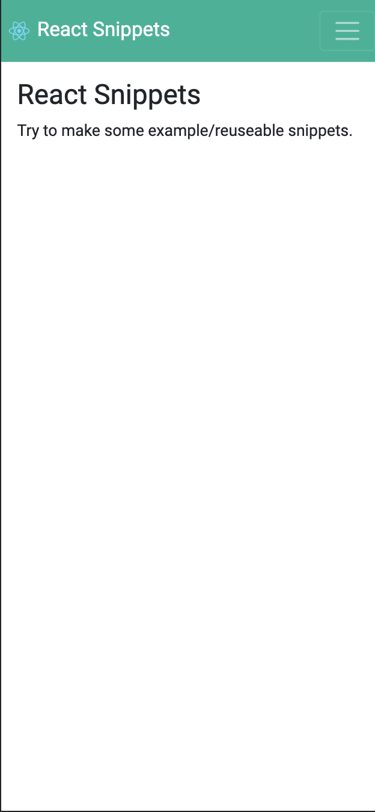

# React Snippets


## To run this React App

In the project directory, you can run:

```npm start```

Runs the app in the development mode.\
Open [http://localhost:3000](http://localhost:3000) to view it in the browser.


## Screenshots

### Responsive
- Responsive Home page



- Responsive full page
